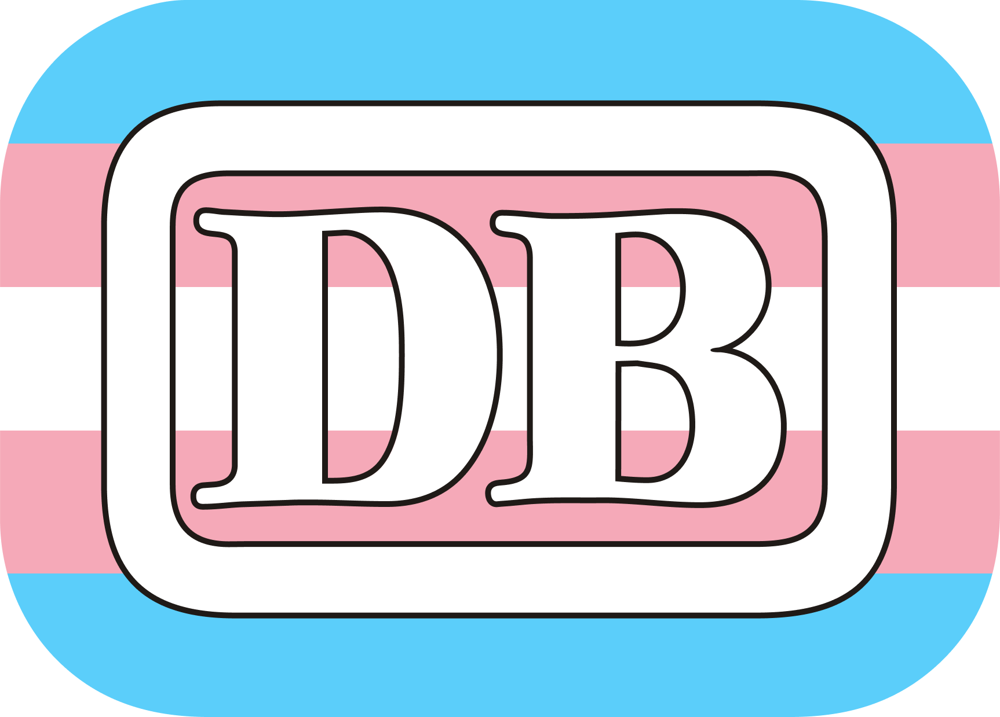

#  Bundesbahn Pride
> Different Pride flag color schemes of the Deutsche Bundesbahn Logo! 🌈

    

### A flag or variant is missing?
Please create an issue.
I will create and commit the missing variant as soon as possible.

### Why?
Why not.

### Could you release the source files?
Currently that's not possible. I can release the SVGs, but currently not the Figma file.

> Maybe some day I'll turn this into a Web Editor instead of publishing the files manually, but only time will tell.